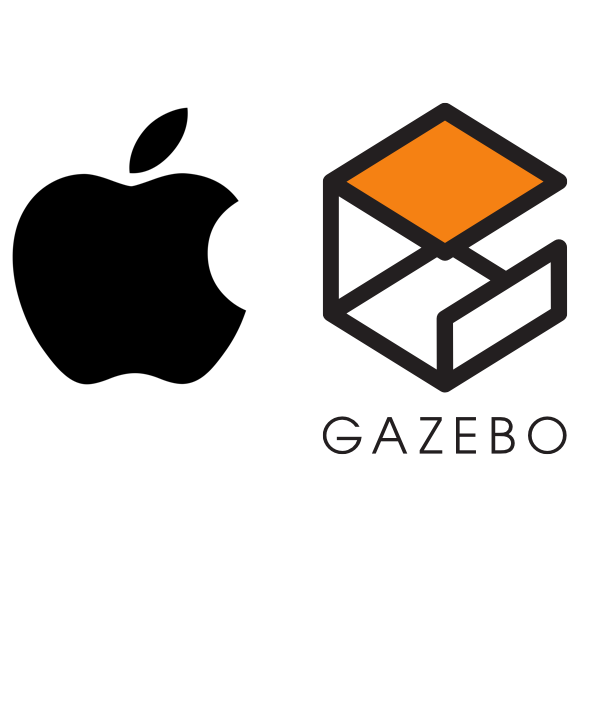

# Fast Heuristics or Autonomous Nvigation in Geographical Unexplored Spaces (fh-ANGUS)

## Introduction
fh-ANGUS is a fastest frontier based exploration algorithm
Parer link : https://arxiv.org/abs/2407.18892

- **Author:**
  1. Seunghyeop Nam(Personal Web: http://117.16.137.18, Linked In: https://www.linkedin.com/in/seunghyeop-nam-6b3201320)
  2. Tuan Anh Nguyen(https://www.linkedin.com/in/tuan-anh-nguyen-9711551b/)
- **Development:** Seunghyeop Nam
- **Thanks to:** Tomasvr (https://github.com/tomasvr/turtlebot3_drlnav)

### Upload Date: 1st of Aug 2024


#### Simulation Videos
- Scenario 1 : https://youtu.be/XwZ63Wk4ATA?si=zUnhKUpt0DK43DZ6
- Scenario 2 : https://youtu.be/ZNepJp0hCFQ?si=lxO2qWWFZ5gARgkm
- Scenario 3 : https://youtu.be/Fm22Bq6hr68?si=mq1fWpwK7YCB9ul5
- Real World Scenario : https://youtu.be/zyH7R7c1yc8


# Turtlebot3 Environment Installation on MacOS(ARM64 M processor)



# Turtlebot3 Environment Installation on MacOS(ARM64 M processor)


This tutorial is for install Turtlebot3 environment with ROS2(Humble) on MacOS Apple silicon (ARM64 architecture)


# Be sure your OSX version is up to date!

Later than MacOS Sonoma 14.4 highly recommended


copy and paste on your terminal down below


First, install anaconda3 on your Mac in link below.


and create environment you are gonna use

```zsh
conda create -n <your_virtual_env_name>
source activate <your_virtual_env_name>

# this adds the conda-forge channel to the new created environment configuration 
conda config --env --add channels conda-forge
# and the robostack channel
conda config --env --add channels robostack-staging
# remove the defaults channel just in case, this might return an error if it is not in the list which is ok
conda config --env --remove channels defaults
```


Next, install ROS2 humble

```zsh
install ros-humble-desktop
```

restart anaconda environment

```zsh
conda deactivate
source activate <your_virtual_env_name>
```


install ROS2 tools for local development

```zsh
conda install compilers cmake pkg-config make ninja colcon-common-extensions catkin_tools
```


You can test by running rviz2

```zsh
conda activate <your_virtual_env_name>
rviz2
```


For next step we need to install gazebo classic which is gazebo11

You can install gazebo with single line with curl commend

```zsh
curl -ssL http://get.gazebosim.org | sh
```


or using brew


Installing brew (incase you don’t have brew)

You can skeep this step if you have brew already.

```zsh
ruby -e "$(curl -fsSL https://raw.githubusercontent.com/Homebrew/install/master/install)"
```


install gazebo11 with brew

(This process might take several minutes)

```zsh
brew tap osrf/simulation
brew install gazebo11
```


run gazebo

```zsh
gazebo

# In case you have a world file
gazebo /path/to/your/world
```


install conda packages below to cooperate gazebo with ROS2 (humble)

```zsh
conda install "robostack-staging::ros-humble-gazebo-*"
conda install "robostack-staging::ros-humble-cartographer-*"
conda install "robostack-staging::ros-humble-turtlebot3*"
conda install "robostack-staging::ros-humble-turtlebot3-*"
conda install robostack-staging::ros-humble-cartographer-ros
conda install robostack-staging::ros-humble-navigation2
conda install robostack-staging::ros-humble-nav2-bringup
conda install robostack-staging::ros-humble-dynamixel-sdk
conda install robostack-staging::ros-humble-slam-toolbox
conda install robostack-staging::ros-humble-nav2-costmap-2d
conda install robostack-staging::ros-humble-nav2-msgs

conda install robostack-staging::ros-humble-sdformat-urdf
conda install robostack-staging::ros-humble-robot-state-publisher
conda install robostack-staging::ros-humble-sdformat-test-files

## Cyclone DDS is known as faster than fastRTPS.
## Get it if you need.
conda install robostack-staging::ros-humble-rmw-cyclonedds-cpp
echo 'export RMW_IMPLEMENTATION=rmw_cyclonedds_cpp' >> ~/.zshrc
```


# FATAL ERROR IN DISTRIBUTED PACKAGES!

There is fatal error in sdformat_urdf package. Dynamically linked shared object libraries in Ubuntu uses .so format and .dylib in MacOS ARM64. But you might have libsdformat_urdf_plugin.so in your sdformat_urdf package.

You can compile libsdformat_urdf_plugin.dylib by your self like below

1. Get source code from. (Don’t forget to change brench to Humble distribution)

1. Change directory to sdformat_urdf-humble/sdformat_urdf and build project with colcon.

```zsh
cd sdformat_urdf-humble/sdformat_urdf
colcon build --symlink-install --cmake-args -DPython3_FIND_VIRTUALENV="ONLY" -DCMAKE_INSTALL_NAME_DIR=$(pwd)/install/lib  -DPYTHON_EXECUTABLE=/opt/homebrew/anaconda3/envs/<your_virtual_env_name>/bin/python -Wno-dev
```

1. The libsdformat_urdf_plugin.dylib is at path below

```zsh
sdformat_urdf-humble/sdformat_urdf/build/sdformat_urdf/libsdformat_urdf_plugin.dylib
```

1. find where is libsdformat_urdf_plugin.so which you want to replace with libsdformat_urdf_plugin.dylib

```zsh
find /opt/homebrew/anaconda3 -name "libsdformat_urdf_plugin.so"
```

1. replace found libsdformat_urdf_plugin.so files with libsdformat_urdf_plugin.dylib you just build.


Or you could just simply download libsdformat_urdf_plugin.dylib file below and replace  libsdformat_urdf_plugin.so (Go to step 4)


Set ROS2 environment for your mac

```zsh
echo 'export ROS_DOMAIN_ID=30 #TURTLEBOT3' >> ~/.zshrc
```


## Testing Environment

Open 2 different terminal


Terminal 1

```zsh
source activate <your_virtual_env_name>
ros2 launch turtlebot3_gazebo turtlebot3_world.launch.py
```


Terminal 2

```zsh
source activate <your_virtual_env_name>
ros2 run turtlebot3_teleop teleop_keyboard
```


If gazebo world launches with turtlebot3 in it and you can control by keyboard, then you are ready to go!


Beside

If you want to create new ROS2 packages make project directory first

```zsh
mkdir -p ~/<your_package_name>/src
cd ~/<your_package_name>/src
```


And then you create your own ROS2 package

```zsh
# For CMAKE(C++) package
ros2 pkg create --build-type ament_cmake <your_package_name>

# For Python package
ros2 pkg create --build-type ament_python <your_package_name>
```


Finally when you build your own package, unfortunately normal case in MacOS you are using virtual environment made with Anacona3. Most of case colcon doesn’t recognise your virtual environment Python execution but detects Anaconda3’s, brew’s or  sometimes MacOS system default Python.

There for you have to designate which CMake and Python to use when you are building your project like below

```zsh
colcon build --symlink-install --cmake-args -DPython3_FIND_VIRTUALENV="ONLY" -DCMAKE_INSTALL_NAME_DIR=$(pwd)/install/lib  -DPYTHON_EXECUTABLE=/opt/homebrew/anaconda3/envs/<your_virtual_env_name>/bin/python -Wno-dev
```


Now it's time to download the repository to the actual code.

First, Open a terminal in the desired location for the new workspace. Clone the repository using:
```
git clone https://github.com/sudo-homebrew/fh-ANGUS.git
```

`cd` into the directory and make sure you are on the main branch
```
cd robotic_navigation_model_drlnav
git checkout main
```

Next, install the correct rosdep tool
```
sudo apt install python3-rosdep2
```

Then initialize rosdep by running
```
rosdep update
```

Now we can use rosdep to install all ROS packages needed by our repository
```
rosdep install -i --from-path src --rosdistro humble -y
```

Now that we have all of the packages in place it is time to build the repository. First update your package list
```
sudo apt update
```

Then install the build tool **colcon** which we will use to build our ROS2 package
```
sudo apt install python3-colcon-common-extensions
```

Next, it's time to actually build the repository code!
```
colcon build
```
After colcon has finished building source the repository
```
source install/setup.zsh
```

The last thing we need to do before running the code is add a few lines to our `~/.zshrc` file so that they are automatically executed whenever we open a new terminal. Add the following lines at the end of your `~/.zshrc` file and **replace ~/path/to/robotic_navigation_model_drlnav/repo with the path where you cloned the repository. (e.g. ~/robotic_navigation_model_drlnav)**
```
# ROS2 domain id for network communication, machines with the same ID will receive each others' messages
export ROS_DOMAIN_ID=1

# Fill in the path to where you cloned the robotic_navigation_model_drlnav repo
WORKSPACE_DIR=~/path/to/robotic_navigation_model_drlnav
export DRLNAV_BASE_PATH=$WORKSPACE_DIR

# Source the workspace
source $WORKSPACE_DIR/install/setup.zsh

# Allow gazebo to find our robotic_navigation_model models
export GAZEBO_MODEL_PATH=$GAZEBO_MODEL_PATH:$WORKSPACE_DIR/src/robotic_navigation_model_simulations/robotic_navigation_model_gazebo/models

# Select which robotic_navigation_model model we will be using (default: burger, waffle, waffle_pi)
export TURTLEBOT3_MODEL=burger

# Allow Gazebo to find the plugin for moving the obstacles
export GAZEBO_PLUGIN_PATH=$GAZEBO_PLUGIN_PATH:$WORKSPACE_DIR/src/robotic_navigation_model_simulations/robotic_navigation_model_gazebo/models/robotic_navigation_model_drl_world/obstacle_plugin/lib
```

For more detailed instructions on ros workspaces check [this guide](https://automaticaddison.com/how-to-create-a-workspace-ros-2-humble-fitzroy/).

**Note: Always make sure to first run ```source install/setup.zsh``` or open a fresh terminal after building with `colcon build`.**

# **Training**


## **Running and training the DRL agent!**

Now that we have finally completed the setup, all that's left to do is run and train the agent.

Open up four different terminals however you like (I recommended using `terminator` or `tmux` for multi-tab). In the first terminal run
```
ros2 launch robotic_navigation_model_gazebo robotic_navigation_model_drl_stage4.launch.py
```
You should see the gazebo GUI come up with the robot model loaded and two moving obstacles (this might take a while to load).
**Note: make sure to run the 'launch' command first before any other nodes as it will set the stage parameter.**

In a second terminal run
```
ros2 run robotic_navigation_model_drl gazebo_goals
```

In a third terminal run
```
ros2 run robotic_navigation_model_drl environment
```

And lastly, in the fourth terminal run the deep_deterministic_policy_gradient agent
For DDPG:
```
ros2 run robotic_navigation_model_drl train_agent ddpg
```

The first argument indicates whether we are testing or training (0 = testing, 1 = training)

<!-- *optional arguments:*
- The second argument indicates the name of the model if we are continuing training (e.g. "path/to/model/deep_deterministic_policy_gradient_1")
- The third argument indicates from which episode to continue training -->

for TD3:
```
ros2 run robotic_navigation_model_drl train_agent td3
```

for DQN:
```
ros2 run robotic_navigation_model_drl train_agent dqn
```

Your robot should now be moving and training progress is being printed to the terminals!

**Note**: The matplotlib graph will initially be empty but will be displayed after the first `GRAPH_DRAW_INTERVAL` episodes configured in `settings.py`. During testing, terminal output is used instead of the graph.

The state of your model will be stored automatically every `STORE_MODEL_INTERVAL` episodes configured in `settings.py`.
You will find the trained model, logfiles, and graphs in the model directory: `model/[HOSTNAME]/[MODEL_NAME]`. Training results per episode are stored in a sequential text file.

Now you have everything up and running to train your model. There are several additional options and utilities available for training which will be discussed below.

## Loading a stored model

The current state of the agent (weights, parameters, replay buffer, and graphs) will be stored automatically every N episodes as configured by the `store_interval` variable in the `common/settings.py` file.

In order to load a model for testing (e.g. deep_deterministic_policy_gradient_0 at episode 500) the following command should be used:

```
ros2 run robotic_navigation_model_drl test_agent ddpg "ddpg_0" 500
```

In order to load a model to continue training (e.g. deep_deterministic_policy_gradient_0 at episode 500) the following command should be used:

```
ros2 run robotic_navigation_model_drl train_agent ddpg "ddpg_0" 500
```

**Note:** You can also test (or continue training) a model on a different stage than where it was originally trained on.

### Loading one of the included example models

Two examples are included for a DDPG and TD3 model. In order to run them, open four terminals like before and run:

Terminal 1:
```
ros2 launch robotic_navigation_model_gazebo robotic_navigation_model_drl_stage9.launch.py
```

Terminal 2:
```
ros2 run robotic_navigation_model_drl gazebo_goals
```

Terminal 3:
```
ros2 run robotic_navigation_model_drl environment
```

Terminal 4:
For DDPG:
```
ros2 run robotic_navigation_model_drl test_agent ddpg 'examples/ddpg_0' 8000
```

Or, for TD3
```
ros2 run robotic_navigation_model_drl test_agent td3 'examples/td3_0' 7400
```

You should then see the example model navigate successfully toward the goal

### Switching environments

You can switch between 10 different environments by changing the stage number in the launch command:
```
ros2 launch robotic_navigation_model_gazebo robotic_navigation_model_drl_stage5.launch.py
```

change `stage5` to any stage between 1-10 to train on different environments.

## **Optional Configuration**

### Settings: change parameters

The `settings.py` file contains most of the interesting parameters that you might wish to change, including the DRL hyperparameters.

### Reward: tweak reward design

The `reward.py` file contains the reward design. Here you can implement different reward functions between which you can switch in the `settings.py` file. For example, to define a new reward function `"B"` you simply add `get_reward_B(...)` to `reward.py` and define the reward per step.

### Backward motion

To enable the robot to also move in the backward direction simply set `ENABLE_BACKWARD` to `True` in `settings.py`.

### Stacking

'Frame stacking' can enable the robot to consider the direction in which obstacles are moving. The robot considers multiple subsequent laser scan frames instead of a single frame at each step. To enable frame stacking, set `ENABLE_STACKING` to `True` in `settings.py`. Also define `STACK_DEPTH` (number of frames per step) and `FRAME_SKIP` (number of frames to skip between two frames in the stack).

## **Utilities**
### Graph Generation

In order to compare results the repository includes a script that graphs the reward curves for different models. The script `reward_graph.py` can be found in the `util` directory.

To compare the reward curve for `deep_deterministic_policy_gradient_0` and `td3_0` every 100 episodes we type:
```
python3 util/reward_graph.py 100 examples/deep_deterministic_policy_gradient_0 examples/td3_0
```

Again, `examples/` should not be included in the path for your own models.

**Note: graph generation will only work correctly if training has not been stopped and continued. Otherwise you first need to merge the different _train_stage*.txt files into a single file**

### Cleaning model data

Training models can generate a lot of data, especially if you save the model often. In order to automatically clean models to save space, two cleaning scripts are included in the `util` folder.

**CAUTION: use the following scripts with caution as deleted data cannot be retrieved! Carefully examine the script settings and double-check the command line arguments you enter**

The following line will clean deep_deterministic_policy_gradient_0 removing all saved model states except:
* The model state for the 4 best-performing episodes
* The model state for the most recent episode
`python3 util/clean_single_model.py deep_deterministic_policy_gradient_0`

If you want to keep more or less data you can adjust the `TOP_EPISODES` parameters in the script itself.

To clean all of the models at once you can use the `purge_all_models.py` script. Carefully check the parameters at the top of the file before executing the script. To execute the script simply type:
```python3 util/purge_all_models.py```

The script will loop through all of your models and select the models to keep like explained above. In addition, models which scored too low or were trained for too few episodes will be removed completely (threshold specified in `purge_all_models.py`).

### Visualization


To enable a complete visualization of the neural network neuron activity and biases simply set `ENABLE_VISUAL` to `True` in `settings.py`. This requires the python3 packages `pyqtgraph` and `PyQt5` to be installed.
The visual should mainly be used during evaluation as it can slow down training significantly.
## Command Specification

**train_agent:**

```ros2 run robotic_navigation_model_drl train_agent [algorithm=dqn/ddpg/td3] [loadmodel=\path\to\model] [loadepisode=episode] ```

* `algorithm`: algorithm to run, one of either: `dqn`, `deep_deterministic_policy_gradient`, `td3`
* `modelpath`: path to the model to be loaded to continue training
* `loadepisode`: is the episode to load from `modelpath`

**test_agent:**

```ros2 run robotic_navigation_model_drl test_agent [algorithm=dqn/ddpg/td3] [loadmodel=\path\to\model] [loadepisode=episode] ```

* `algorithm`: algorithm to run, one of either: `dqn`, `deep_deterministic_policy_gradient`, `td3`
* `modelpath`: path to model to be loaded for testing
* `loadepisode`: is the episode to load from `modelpath`

# Physical Robot

The models trained using this framework were validated on a low-cost physical system. Video demonstrations can be found on my [YouTube channel](https://www.youtube.com/@tomasvr1/videos).


The are three main requirements for a robot to be compatible with this project:
* The robot needs to provide LiDAR scan information
* The robot needs to provide any kind of odometry information (e.g. tachometers, SLAM, AMCL or GPS)
* The robot needs to be able to work with linear and angular velocity messages

To run one of your models (trained in simulation) on a physical robot follow these steps:
* In settings.py, adjust the REAL ROBOT ENVIRONMENT SETTINGS
  * **REAL_TOPIC**: Set the right ROS topics for your laser scan, odometry and velocity inputs/outputs
  * **REAL_N_SCAN_SAMPLES**: Configure the number of Lidar samples your robot will provide
  * **REAL_LIDAR_CORRECTION**: Depending on the dimensions of your robot the LiDAR values might need to be corrected to avoid the agent from detecting a 'collision' when the robot has not yet actually collided with any obstacle. This value is simply subtracted from the real LiDAR readings and finding the right value requires some trial and error.
  * Set the remaining options such as the arena dimensions, max velocities, max LiDAR distance, and goal and collision thresholds.

Next, when using a physical robot we do not need to run the gazebo simulation node or the gazebo_goals node. We will however still need to run an environment node and an agent node.

At this point, turn on the robot and initialize all of its components. Ensure that:
* LiDAR scan ROS messages are being sent over the configured TOPIC_SCAN topic
* Odometry ROS messages are being sent over the TOPIC_ODOM topic
* The robot is listening for velocity ROS messages on the TOPIC_VELO topic.

**Note:** If you are running nodes on multiple machines (e.g. one laptop and one robot) ensure that all machines have the same value set for `ROS_DOMAIN_ID` in `~/.zshrc`:

`export ROS_DOMAIN_ID=[X]` (X can be any number as long as it is the same for each machine).

Also ensure that all machines are connected to the same Local Area Network (LAN).

Now, open a terminal on your laptop (or robot) and run the environment node for a real robot:
```
ros2 run robotic_navigation_model_drl real_environment
```

Then, open another terminal and run the agent node for a real robot (substitute your model name and desired episode to load):
```
ros2 run robotic_navigation_model_drl real_agent [ALGORITHM_NAME] [MODEL_NAME] [MODEL_EPISODE]
```
For example:
```
ros2 run robotic_navigation_model_drl real_agent ddpg ddpg_1_stage4 1000
```

If everything loads correctly, you can now use the included script to generate a goal at location (x=1, y=1):
```
./spawn_goal 1 1
```

**And that's it!** You should now see the robot start moving toward the goal while avoiding obstacles.

**Note:** You can use RViz2 in order to visualize the LiDAR scans for debugging and fine-tuning the REAL_LIDAR_CORRECTION value: simply add a `laser_scan` display type and set its topic to `TOPIC_SCAN`.

# **Troubleshooting**

## **zsh: /opt/ros/humble/setup.zsh: No such file or directory**

Make sure that you source the correct setup files in your `~/.zshrc` as described in the installation section of this guide.

## **Package 'robotic_navigation_model_gazebo' not found: "package 'robotic_navigation_model_gazebo' not found, searching: ['/opt/ros/humble']"**

Make sure to run `source install/setup.zsh` from the root of the repository in every terminal every time after you build the project using `colcon_build`. Otherwise, the nodes will not run the updated version of your code but the old version from the last time you built and sourced.
